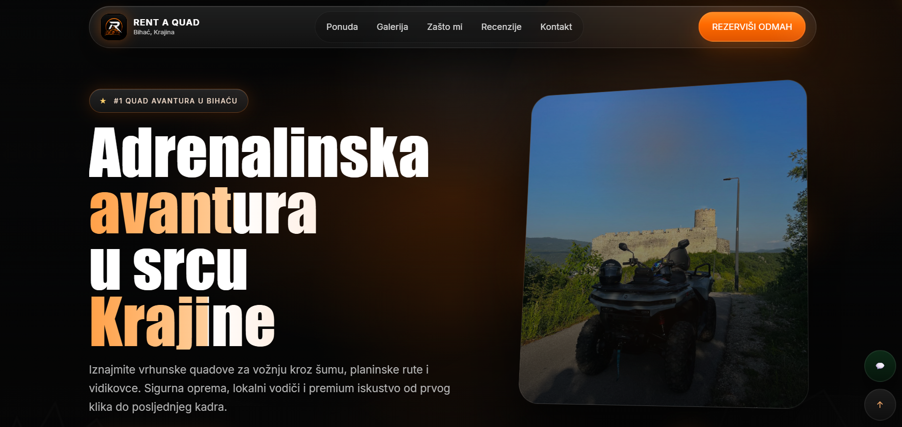
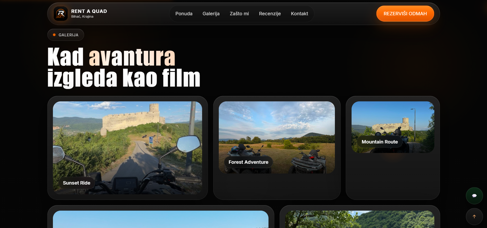
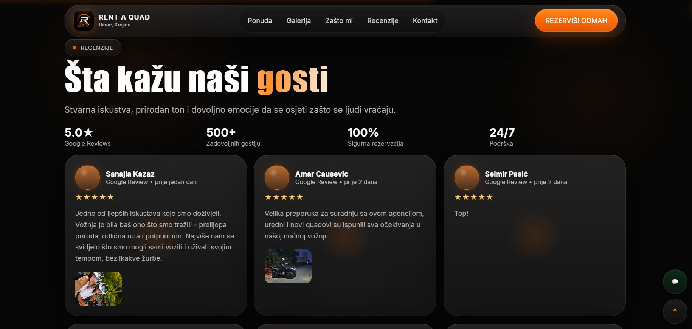
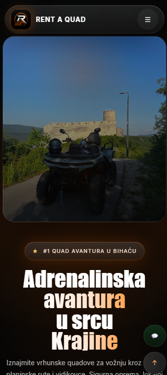
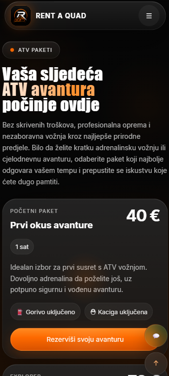
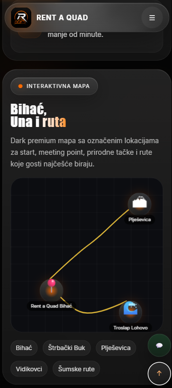

<div align="center">

# 🏔️ RENT A QUAD BIHAĆ

### Premium Tourism Website • UI/UX Design • Frontend Development • SEO Optimization

Modern premium tourism website built from scratch for a real client in Bosnia and Herzegovina.

<p>

<a href="https://rentaquadbihac.com">

</a>

<a href="https://github.com/Emin2024541561">

</a>

</p>

<p>


</p>

</div>

---

# 📖 About

Rent a Quad Bihać is a fully custom-designed premium tourism website created for a real quad rental business located in **Bihać, Bosnia and Herzegovina**.

The objective of the project was not only to present services, but to create an immersive digital experience capable of communicating quality, adventure and trust before the visitor reaches the booking section.

Instead of relying on templates or website builders, the entire interface was designed and developed from scratch using semantic HTML, modern CSS and Vanilla JavaScript.

The visual direction is inspired by premium digital products from Apple, Linear, Vercel, Framer and modern Awwwards-winning experiences.

---

# 🖥 Desktop Experience

## Landing Page



---

## Gallery Showcase



---

## Reviews Section



---

# 📱 Mobile Experience

| Landing Page | Packages | Interactive Map |
|---------------|-----------|----------------|
|  |  |  |

---

# ✨ Project Highlights

- Premium UI/UX Design
- Fully Responsive Layout
- Custom Navigation
- Interactive Hero Section
- Smooth Scroll Animations
- Interactive Gallery
- Modern Card Components
- Animated Statistics
- Premium Typography
- Booking Form
- Formspree Integration
- Interactive Maps
- Mobile-first Optimization
- SEO Optimized
- GitHub Pages Deployment
- Custom Domain
- Performance Optimized

---

# 🚀 Features

## Premium Hero

- Immersive landing experience
- Large typography
- Interactive image card
- Animated lighting
- Floating visual effects
- Conversion focused CTA

---

## Booking

- Reservation form
- Email notifications via Formspree
- Client-side validation
- Instant success feedback

---

## Gallery

- Responsive grid
- Large cinematic images
- Hover animations
- Premium layout

---

## Interactive Map

- Tourist locations
- Route visualization
- Destination overview

---

## Reviews

- Premium review cards
- Statistics
- Social proof
- Responsive carousel

---

# 🛠 Technology Stack

| Category | Technologies |
|-----------|--------------|
| Frontend | HTML5 |
| Styling | CSS3 |
| Programming | Vanilla JavaScript |
| Forms | Formspree |
| Maps | Google Maps |
| Version Control | Git |
| Hosting | GitHub Pages |
| Domain | Namecheap |
| SEO | Schema.org, Open Graph, Sitemap, Robots.txt |

---

# 📂 Project Structure

```text
rentaquadbihac/

├── index.html
├── styles.css
├── script.js
│
├── images/
├── screenshots/
├── favicon/
│
├── robots.txt
├── sitemap.xml
├── site.webmanifest
├── favicon.ico
└── README.md
```

---

# 🎯 Design Philosophy

This project focuses on delivering emotion before information.

Instead of overwhelming visitors with text, every section was carefully designed to guide users through a premium visual journey inspired by modern product websites.

Core principles include:

- Visual hierarchy
- Minimalism
- Motion Design
- Storytelling
- Micro Interactions
- Conversion Psychology
- Premium Branding

---

# 📈 SEO

Implemented professional on-page SEO including:

- Semantic HTML5
- Local Business Schema
- Open Graph
- Twitter Cards
- XML Sitemap
- robots.txt
- Canonical URLs
- Meta Optimization
- Mobile Optimization
- Structured Data

---

# ⚡ Performance

Optimized for:

- Fast Loading
- Responsive Layout
- Lightweight Animations
- Mobile Performance
- Modern CSS Architecture
- Clean HTML Structure

---

# 🌍 Deployment

Hosting

- GitHub Pages

Domain

https://rentaquadbihac.com

---

# 👨‍💼 Client

**Rent a Quad Bihać**

📍 Bihać, Bosnia and Herzegovina

Industry

Adventure Tourism

Outdoor Experiences

Quad Rental

---

# 👨‍💻 Developed By

# EMINETIC

Creative Digital Agency

Specialized in

- Premium Web Design
- Frontend Development
- UI/UX Design
- Branding
- SEO Optimization
- AI Solutions

🌐 https://eminetik.com

GitHub

https://github.com/Emin2024541561

---

# 📄 License

This project was developed for a private client.

The source code is published for portfolio and demonstration purposes only.

© 2026 EMINETIC. All Rights Reserved.